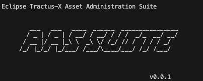

# aas-suite

Eclipse Tractus-X Asset Administration Shell Suite [AAS Suite] - An integration between BaSyx & Tractus-X Python SDKs

## Powered by

## Licenses

- [Apache-2.0](https://raw.githubusercontent.com/eclipse-tractusx/aas-suite/main/LICENSE) for code
- [CC-BY-4.0](https://spdx.org/licenses/CC-BY-4.0.html) for non-code

## NOTICE

This work is licensed under the [CC-BY-4.0](https://creativecommons.org/licenses/by/4.0/legalcode).

- SPDX-License-Identifier: CC-BY-4.0
- SPDX-FileCopyrightText: 2025 Contributors to the Eclipse Foundation
- Source URL: https://github.com/eclipse-tractusx/aas-suite
